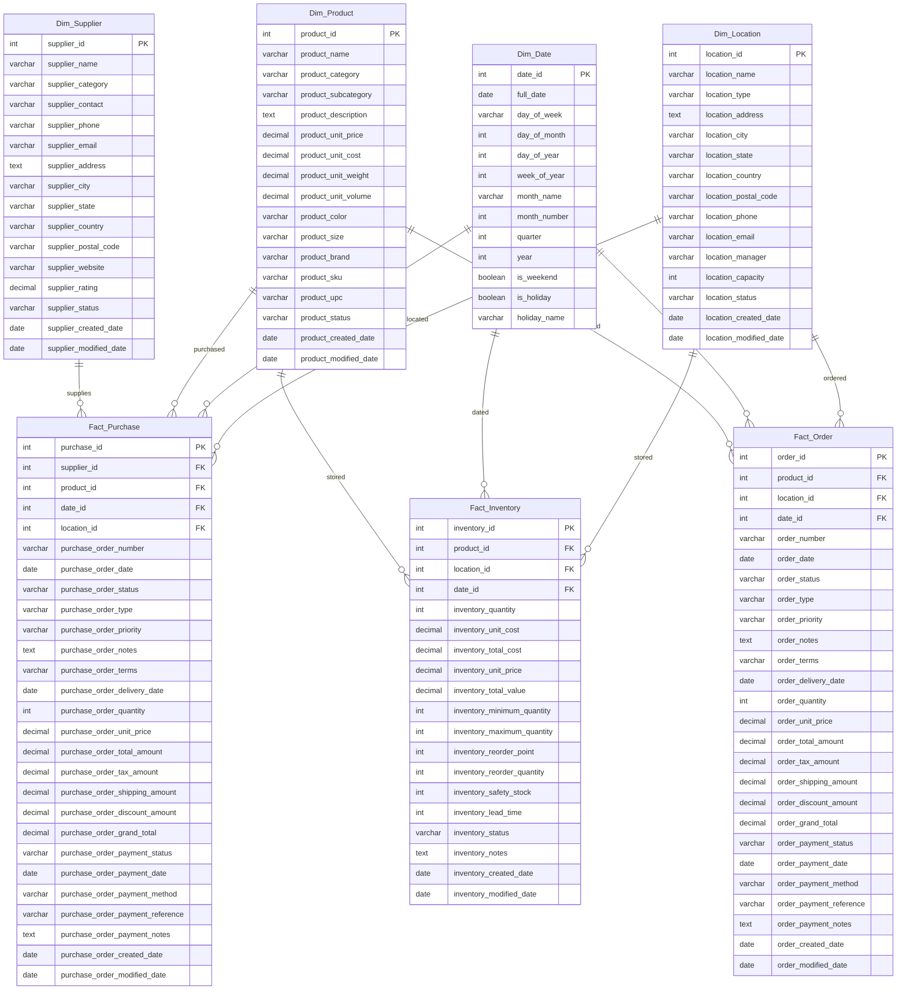

# Database Schema Documentation

## Table Definitions

### Dim_Supplier
```sql
CREATE TABLE Dim_Supplier (
    supplier_id INT PRIMARY KEY,
    supplier_name VARCHAR(255),
    supplier_category VARCHAR(255),
    supplier_contact VARCHAR(255),
    supplier_phone VARCHAR(20),
    supplier_email VARCHAR(255),
    supplier_address TEXT,
    supplier_city VARCHAR(100),
    supplier_state VARCHAR(100),
    supplier_country VARCHAR(100),
    supplier_postal_code VARCHAR(20),
    supplier_website VARCHAR(255),
    supplier_rating DECIMAL(3,2),
    supplier_status VARCHAR(50),
    supplier_created_date DATE,
    supplier_modified_date DATE
);
```

### Dim_Product
```sql
CREATE TABLE Dim_Product (
    product_id INT PRIMARY KEY,
    product_name VARCHAR(255),
    product_category VARCHAR(255),
    product_subcategory VARCHAR(255),
    product_description TEXT,
    product_unit_price DECIMAL(10,2),
    product_unit_cost DECIMAL(10,2),
    product_unit_weight DECIMAL(10,2),
    product_unit_volume DECIMAL(10,2),
    product_color VARCHAR(50),
    product_size VARCHAR(50),
    product_brand VARCHAR(100),
    product_sku VARCHAR(50),
    product_upc VARCHAR(50),
    product_status VARCHAR(50),
    product_created_date DATE,
    product_modified_date DATE
);
```

### Dim_Date
```sql
CREATE TABLE Dim_Date (
    date_id INT PRIMARY KEY,
    full_date DATE,
    day_of_week VARCHAR(10),
    day_of_month INT,
    day_of_year INT,
    week_of_year INT,
    month_name VARCHAR(10),
    month_number INT,
    quarter INT,
    year INT,
    is_weekend BOOLEAN,
    is_holiday BOOLEAN,
    holiday_name VARCHAR(50)
);
```

### Dim_Location
```sql
CREATE TABLE Dim_Location (
    location_id INT PRIMARY KEY,
    location_name VARCHAR(255),
    location_type VARCHAR(50),
    location_address TEXT,
    location_city VARCHAR(100),
    location_state VARCHAR(100),
    location_country VARCHAR(100),
    location_postal_code VARCHAR(20),
    location_phone VARCHAR(20),
    location_email VARCHAR(255),
    location_manager VARCHAR(255),
    location_capacity INT,
    location_status VARCHAR(50),
    location_created_date DATE,
    location_modified_date DATE
);
```

### Fact_Purchase
```sql
CREATE TABLE Fact_Purchase (
    purchase_id INT PRIMARY KEY,
    supplier_id INT,
    product_id INT,
    date_id INT,
    location_id INT,
    purchase_order_number VARCHAR(50),
    purchase_order_date DATE,
    purchase_order_status VARCHAR(50),
    purchase_order_type VARCHAR(50),
    purchase_order_priority VARCHAR(50),
    purchase_order_notes TEXT,
    purchase_order_terms VARCHAR(255),
    purchase_order_delivery_date DATE,
    purchase_order_quantity INT,
    purchase_order_unit_price DECIMAL(10,2),
    purchase_order_total_amount DECIMAL(10,2),
    purchase_order_tax_amount DECIMAL(10,2),
    purchase_order_shipping_amount DECIMAL(10,2),
    purchase_order_discount_amount DECIMAL(10,2),
    purchase_order_grand_total DECIMAL(10,2),
    purchase_order_payment_status VARCHAR(50),
    purchase_order_payment_date DATE,
    purchase_order_payment_method VARCHAR(50),
    purchase_order_payment_reference VARCHAR(50),
    purchase_order_payment_notes TEXT,
    purchase_order_created_date DATE,
    purchase_order_modified_date DATE,
    FOREIGN KEY (supplier_id) REFERENCES Dim_Supplier(supplier_id),
    FOREIGN KEY (product_id) REFERENCES Dim_Product(product_id),
    FOREIGN KEY (date_id) REFERENCES Dim_Date(date_id),
    FOREIGN KEY (location_id) REFERENCES Dim_Location(location_id)
);
```

### Fact_Inventory
```sql
CREATE TABLE Fact_Inventory (
    inventory_id INT PRIMARY KEY,
    product_id INT,
    location_id INT,
    date_id INT,
    inventory_quantity INT,
    inventory_unit_cost DECIMAL(10,2),
    inventory_total_cost DECIMAL(10,2),
    inventory_unit_price DECIMAL(10,2),
    inventory_total_value DECIMAL(10,2),
    inventory_minimum_quantity INT,
    inventory_maximum_quantity INT,
    inventory_reorder_point INT,
    inventory_reorder_quantity INT,
    inventory_safety_stock INT,
    inventory_lead_time INT,
    inventory_status VARCHAR(50),
    inventory_notes TEXT,
    inventory_created_date DATE,
    inventory_modified_date DATE,
    FOREIGN KEY (product_id) REFERENCES Dim_Product(product_id),
    FOREIGN KEY (location_id) REFERENCES Dim_Location(location_id),
    FOREIGN KEY (date_id) REFERENCES Dim_Date(date_id)
);
```

### Fact_Order
```sql
CREATE TABLE Fact_Order (
    order_id INT PRIMARY KEY,
    product_id INT,
    location_id INT,
    date_id INT,
    order_number VARCHAR(50),
    order_date DATE,
    order_status VARCHAR(50),
    order_type VARCHAR(50),
    order_priority VARCHAR(50),
    order_notes TEXT,
    order_terms VARCHAR(255),
    order_delivery_date DATE,
    order_quantity INT,
    order_unit_price DECIMAL(10,2),
    order_total_amount DECIMAL(10,2),
    order_tax_amount DECIMAL(10,2),
    order_shipping_amount DECIMAL(10,2),
    order_discount_amount DECIMAL(10,2),
    order_grand_total DECIMAL(10,2),
    order_payment_status VARCHAR(50),
    order_payment_date DATE,
    order_payment_method VARCHAR(50),
    order_payment_reference VARCHAR(50),
    order_payment_notes TEXT,
    order_created_date DATE,
    order_modified_date DATE,
    FOREIGN KEY (product_id) REFERENCES Dim_Product(product_id),
    FOREIGN KEY (location_id) REFERENCES Dim_Location(location_id),
    FOREIGN KEY (date_id) REFERENCES Dim_Date(date_id)
);
```

## Database Diagram



## Table Relationships

1. **Dim_Supplier to Fact_Purchase**
   - One supplier can have many purchases
   - Relationship: One-to-Many
   - Key: supplier_id

2. **Dim_Product to Fact_Purchase**
   - One product can be purchased many times
   - Relationship: One-to-Many
   - Key: product_id

3. **Dim_Product to Fact_Inventory**
   - One product can be stored in multiple locations
   - Relationship: One-to-Many
   - Key: product_id

4. **Dim_Product to Fact_Order**
   - One product can be ordered many times
   - Relationship: One-to-Many
   - Key: product_id

5. **Dim_Date to Fact Tables**
   - One date can be associated with many records in fact tables
   - Relationship: One-to-Many
   - Key: date_id

6. **Dim_Location to Fact Tables**
   - One location can be associated with many records in fact tables
   - Relationship: One-to-Many
   - Key: location_id

## Key Features

1. **Dimensional Modeling**
   - Star schema design with fact and dimension tables
   - Surrogate keys for all tables
   - Natural keys preserved in dimension tables

2. **Data Types**
   - Appropriate data types for each column
   - Decimal precision for monetary values
   - Date fields for temporal tracking
   - Text fields for descriptions and notes

3. **Constraints**
   - Primary keys on all tables
   - Foreign key relationships maintained
   - Appropriate field lengths for varchar columns

4. **Audit Fields**
   - Created and modified dates on all tables
   - Status fields for tracking record state
   - Notes fields for additional information

5. **Business Logic**
   - Support for purchase order processing
   - Inventory management capabilities
   - Order processing functionality
   - Location and supplier management 