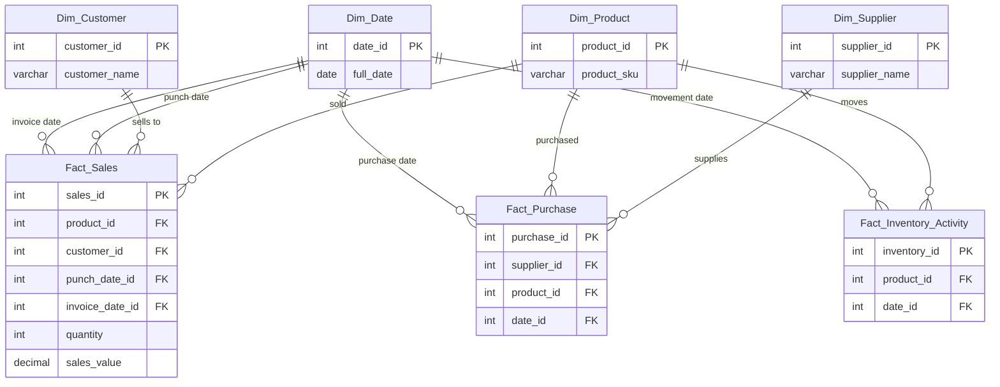

# 📚 Database Schema

A detailed overview of the star-schema data warehouse created by the refactored ETL pipeline.

---

## 🗂️ Dimensional Model

| Table | Grain | Purpose |
|-------|-------|---------|
| **Dim_Date**            | One row per calendar date              | Time intelligence (YTD, MTD, etc.) |
| **Dim_Product**         | One row per SKU / product              | Product catalogue & attributes      |
| **Dim_Customer**        | One row per sold-to customer           | Customer attributes & addresses     |
| **Dim_Supplier**        | One row per supplier                   | Procurement partners                |
| **Fact_Sales**          | One row per order line                 | Quantities & values sold            |
| **Fact_Purchase**       | One row per PO line                    | Quantities & cost of purchases      |
| **Fact_Inventory_Activity** | One row per inventory movement event | Stock in/out adjustments            |

---

## 📑 Table Definitions

### Dim_Date
```sql
CREATE TABLE Dim_Date (
    date_id            INT PRIMARY KEY,
    full_date          DATE,
    day_of_week        VARCHAR(10),
    day_of_month       INT,
    day_of_year        INT,
    week_of_year       INT,
    month_name         VARCHAR(10),
    month_number       INT,
    quarter            INT,
    year               INT,
    is_weekend         TINYINT(1),
    is_holiday         TINYINT(1),
    holiday_name       VARCHAR(50)
);
```

### Dim_Product
```sql
CREATE TABLE Dim_Product (
    product_id           INT PRIMARY KEY,
    product_name         VARCHAR(255),
    product_category     VARCHAR(255),
    product_subcategory  VARCHAR(255),
    product_description  TEXT,
    product_unit_measure VARCHAR(50),
    product_unit_price   DECIMAL(10,2),
    product_unit_cost    DECIMAL(10,2),
    product_hsn_code     VARCHAR(50),
    product_tax_slab     VARCHAR(20),
    product_unit_weight  DECIMAL(10,2),
    product_unit_volume  DECIMAL(10,2),
    product_color        VARCHAR(50),
    product_size         VARCHAR(50),
    product_brand        VARCHAR(100),
    product_sku          VARCHAR(50),
    product_upc          VARCHAR(50),
    product_status       VARCHAR(50),
    product_created_date DATE,
    product_modified_date DATE
);
```

### Dim_Customer
```sql
CREATE TABLE Dim_Customer (
    customer_id           INT PRIMARY KEY,
    customer_code         VARCHAR(50),
    customer_name         VARCHAR(255),
    gst_number            VARCHAR(50),
    billing_address       TEXT,
    shipping_address      TEXT,
    phone                 VARCHAR(50),
    customer_created_date DATE,
    customer_modified_date DATE
);
```

### Dim_Supplier
```sql
CREATE TABLE Dim_Supplier (
    supplier_id           INT PRIMARY KEY,
    supplier_name         VARCHAR(255),
    supplier_category     VARCHAR(255),
    supplier_contact      VARCHAR(255),
    supplier_phone        VARCHAR(20),
    supplier_email        VARCHAR(255),
    supplier_address      TEXT,
    supplier_city         VARCHAR(100),
    supplier_state        VARCHAR(100),
    supplier_country      VARCHAR(100),
    supplier_postal_code  VARCHAR(20),
    supplier_website      VARCHAR(255),
    supplier_rating       DECIMAL(3,2),
    supplier_status       VARCHAR(50),
    supplier_created_date DATE,
    supplier_modified_date DATE
);
```

### Fact_Sales
```sql
CREATE TABLE Fact_Sales (
    sales_id          INT PRIMARY KEY,
    product_id        INT,
    customer_id       INT,
    punch_date_id     INT,
    invoice_date_id   INT,
    order_id          VARCHAR(100),
    invoice_number    VARCHAR(100),
    quantity          INT,
    sales_value       DECIMAL(15,2),
    FOREIGN KEY (product_id)      REFERENCES Dim_Product(product_id),
    FOREIGN KEY (customer_id)     REFERENCES Dim_Customer(customer_id),
    FOREIGN KEY (punch_date_id)   REFERENCES Dim_Date(date_id),
    FOREIGN KEY (invoice_date_id) REFERENCES Dim_Date(date_id)
);
```

### Fact_Purchase
```sql
CREATE TABLE Fact_Purchase (
    purchase_id                INT PRIMARY KEY,
    supplier_id                INT,
    product_id                 INT,
    date_id                    INT,
    purchase_order_number      VARCHAR(50),
    purchase_order_date        DATE,
    purchase_order_status      VARCHAR(50),
    purchase_order_type        VARCHAR(50),
    purchase_order_priority    VARCHAR(50),
    purchase_order_notes       TEXT,
    purchase_order_terms       VARCHAR(255),
    purchase_order_delivery_date DATE,
    purchase_order_quantity    INT,
    purchase_order_unit_price  DECIMAL(10,2),
    purchase_order_total_amount DECIMAL(10,2),
    purchase_order_tax_amount  DECIMAL(10,2),
    purchase_order_shipping_amount DECIMAL(10,2),
    purchase_order_discount_amount DECIMAL(10,2),
    purchase_order_grand_total DECIMAL(10,2),
    purchase_order_payment_status VARCHAR(50),
    purchase_order_payment_date DATE,
    purchase_order_payment_method VARCHAR(50),
    purchase_order_payment_reference VARCHAR(50),
    purchase_order_payment_notes TEXT,
    purchase_order_created_date DATE,
    purchase_order_modified_date DATE,
    FOREIGN KEY (supplier_id) REFERENCES Dim_Supplier(supplier_id),
    FOREIGN KEY (product_id)  REFERENCES Dim_Product(product_id),
    FOREIGN KEY (date_id)     REFERENCES Dim_Date(date_id)
);
```

### Fact_Inventory_Activity
```sql
CREATE TABLE Fact_Inventory_Activity (
    inventory_id        INT PRIMARY KEY,
    product_id          INT,
    date_id             INT,
    activity_type       VARCHAR(100),
    reference_type      VARCHAR(100),
    source_location     VARCHAR(100),
    destination_location VARCHAR(100),
    item_type           VARCHAR(50),
    quantity            DECIMAL(15,2),
    notes               TEXT,
    FOREIGN KEY (product_id) REFERENCES Dim_Product(product_id),
    FOREIGN KEY (date_id)    REFERENCES Dim_Date(date_id)
);
```

---

## 🌐 Entity-Relationship Diagram



---

## 🔑 Surrogate Keys & Indexing
- All tables use auto-incrementing **surrogate keys** to decouple analytics from source-system keys.
- Fact tables reference dimensions only via these surrogate keys.
- Create composite **bitmap indexes** (or MySQL equivalent BTREE) on foreign-key columns in fact tables if performance becomes an issue.

---

## 📝 Change Log
| Date | Change |
|------|--------|
| 2025-06-23 | Added `punch_date_id` & `invoice_date_id` to **Fact_Sales** |
| 2025-06-23 | Initial release of schema documentation |

## Table Relationships

1. **Dim_Supplier to Fact_Purchase**
   - One supplier can have many purchases
   - Relationship: One-to-Many
   - Key: supplier_id

2. **Dim_Product to Fact_Purchase**
   - One product can be purchased many times
   - Relationship: One-to-Many
   - Key: product_id

5. **Dim_Date to Fact Tables**
   - One date can be associated with many records in fact tables
   - Relationship: One-to-Many
   - Key: date_id

## Key Features

1. **Dimensional Modeling**
   - Star schema design with fact and dimension tables
   - Surrogate keys for all tables
   - Natural keys preserved in dimension tables

2. **Data Types**
   - Appropriate data types for each column
   - Decimal precision for monetary values
   - Date fields for temporal tracking
   - Text fields for descriptions and notes

3. **Constraints**
   - Primary keys on all tables
   - Foreign key relationships maintained
   - Appropriate field lengths for varchar columns

4. **Audit Fields**
   - Created and modified dates on all tables
   - Status fields for tracking record state
   - Notes fields for additional information

5. **Business Logic**
   - Support for purchase order processing
   - Inventory management capabilities
   - Order processing functionality
   - Location and supplier management

## Table Row Counts

Current row counts in the database:

### Dimension Tables
- Dim_Supplier: 54 rows
- Dim_Product: 1,530 rows
- Dim_Date: 731 rows
- Dim_Customer: 1,089 rows

### Fact Tables
- Fact_Purchase: 477 rows
- Fact_Inventory_Activity: 4,650 rows
- Fact_Returns: 1 row
- Fact_Sales: 19,392 rows

### Staging Tables
- Stage_BOM: 2,756 rows
- Stage_CustomerMaster: 1,089 rows
- Stage_InventoryActivities: 4,650 rows
- Stage_OrderLine: 19,392 rows
- Stage_ProductMaster: 345 rows
- Stage_PurchaseOrders: 477 rows
- Stage_Returns: 1 row
- Stage_SKUMaster: 1,530 rows
- Stage_SupplierMaster: 54 rows

Note: Some tables are not yet implemented in the database but are included in the schema design for future implementation. The staging tables contain the raw data that is transformed into the dimension and fact tables. 